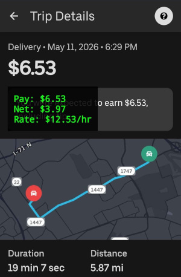
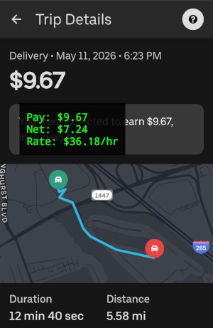
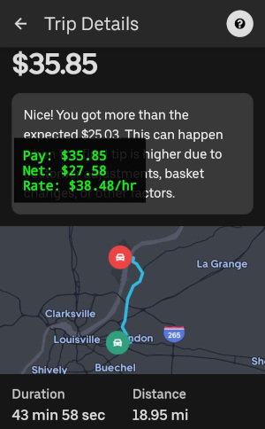

# Uber Eats Profitability Overlay (2023 Ford Ranger Edition)

This Android application serves as a real-time profitability overlay (Heads-Up Display - HUD) for Uber Eats delivery drivers. It's designed to run alongside the official Uber Driver app, providing immediate insights into the true net profit and effective hourly rate of incoming delivery offers.

  
  
  

## Purpose

As an Uber Eats driver, I wanted a quick and accurate way to assess the profitability of each delivery offer. The standard Uber app provides a payout, but it doesn't factor in the specific operating costs of my vehicle. This app addresses that by calculating the true net profit and an estimated hourly rate *before* accepting an order.

## Personal Project - Tailored for a 2023 Ford Ranger

This application is a personal project specifically developed and calibrated for my **2023 Ford Ranger**. The cost calculations are based on its particular fuel efficiency (MPG) and estimated wear-and-tear costs per mile.

### Cost Calculation Breakdown:

-   **Gas Price Per Gallon:** Currently set at `$4.10` (fixed).
-   **Truck MPG:** `22.0` miles per gallon.
-   **Wear and Tear Per Mile:** `$0.25`.
-   **Total Cost Per Mile:** `(Gas Price / MPG) + Wear & Tear` (approximately `$0.436` per mile).

The app scrapes the raw pay, distance, and estimated time from the Uber Driver app's offer screen, then applies these vehicle-specific costs to display:

-   **Pay:** The raw payout from Uber.
-   **Net:** The estimated net profit after deducting vehicle operating costs.
-   **Rate:** The estimated hourly rate based on the net profit and estimated delivery time.

## Future Enhancements

While the current gas price is fixed within the app, a potential future enhancement could include dynamically scanning for current local gas prices to make the cost calculations even more precise. For now, the fixed price serves its purpose, especially given the current stability in gas prices.